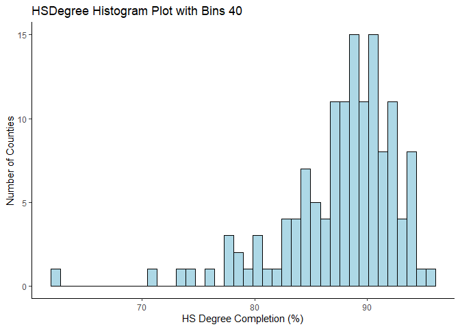
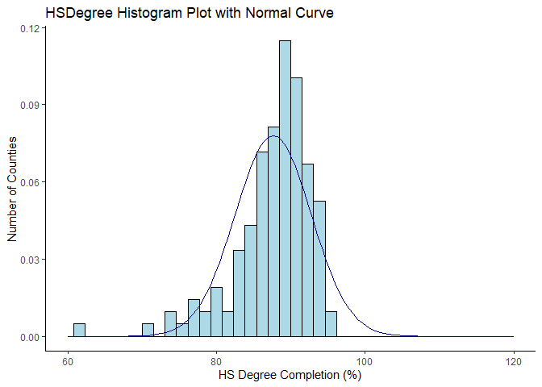
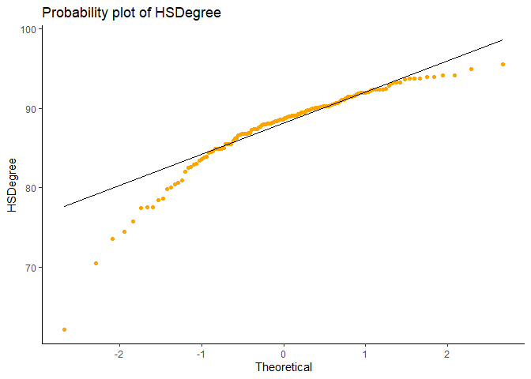
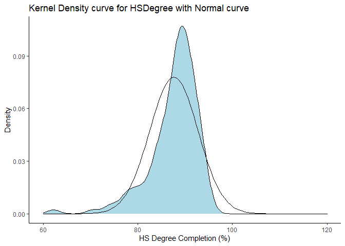
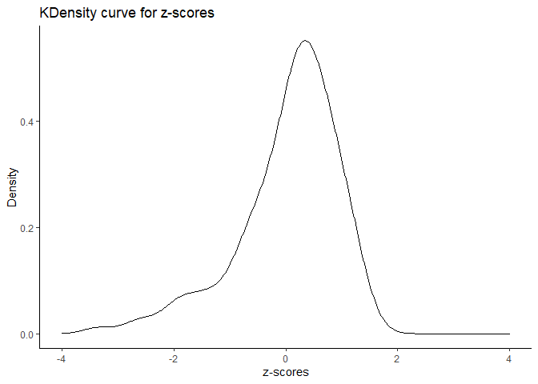

Assignment 05
================
Taniya Adhikari
9/20/2020

**Answer 1:**

| Id             |  Id2 | Geography                       | PopGroupID | POPGROUP.display.label | RacesReported | HSDegree | BachDegree |
| :------------- | ---: | :------------------------------ | ---------: | :--------------------- | ------------: | -------: | ---------: |
| 0500000US01073 | 1073 | Jefferson County, Alabama       |          1 | Total population       |        660793 |     89.1 |       30.5 |
| 0500000US04013 | 4013 | Maricopa County, Arizona        |          1 | Total population       |       4087191 |     86.8 |       30.2 |
| 0500000US04019 | 4019 | Pima County, Arizona            |          1 | Total population       |       1004516 |     88.0 |       30.8 |
| 0500000US06001 | 6001 | Alameda County, California      |          1 | Total population       |       1610921 |     86.9 |       42.8 |
| 0500000US06013 | 6013 | Contra Costa County, California |          1 | Total population       |       1111339 |     88.8 |       39.7 |

A table of the Dataset with first 5 values.

> According to the Table above 8 elements to this data \[1,2\]:

> 1.  **Id:** *ID of the county. It’s a categorical variable which
>     includes integers and characters.*  
> 2.  **Id2:** *are the last 4 digit of the Id column and a Nominal
>     variable despite of integer value.*  
> 3.  **Geography:** *It provides area information of the population
>     group. It’s a categorical variable.*  
> 4.  **PopGroupID:** *population group ID, probably nominal variable,
>     but also a variable that is irrelevant.*  
> 5.  **POPGROUP.display-label:** *only displays value “Total
>     Population”.The data are presented as population counts for the
>     total population and various subgroups and percentages. It’s a
>     population information.*  
> 6.  **RacesReported:** *number of responses on question of race for
>     each county. Numerical variable and discrete variable.*  
> 7.  **HSDegree:** *a percentage of high school degree completion. It’s
>     a discrete variable.*  
> 8.  **BachDegree:** *a percentage of bachelors degree completion. It’s
>     a discrete variable.*

**Answer 2:**

``` r
str(df)
```

    ## 'data.frame':    136 obs. of  8 variables:
    ##  $ Id                    : chr  "0500000US01073" "0500000US04013" "0500000US04019" "0500000US06001" ...
    ##  $ Id2                   : int  1073 4013 4019 6001 6013 6019 6029 6037 6059 6065 ...
    ##  $ Geography             : chr  "Jefferson County, Alabama" "Maricopa County, Arizona" "Pima County, Arizona" "Alameda County, California" ...
    ##  $ PopGroupID            : int  1 1 1 1 1 1 1 1 1 1 ...
    ##  $ POPGROUP.display.label: chr  "Total population" "Total population" "Total population" "Total population" ...
    ##  $ RacesReported         : int  660793 4087191 1004516 1610921 1111339 965974 874589 10116705 3145515 2329271 ...
    ##  $ HSDegree              : num  89.1 86.8 88 86.9 88.8 73.6 74.5 77.5 84.6 80.6 ...
    ##  $ BachDegree            : num  30.5 30.2 30.8 42.8 39.7 19.7 15.4 30.3 38 20.7 ...

The above output shows the structure of the dataset. It has 136
observations and 8 variables.

``` r
n_row <- nrow(df)
n_col <- ncol(df)
```

The number of rows in the dataset is 136.

The number of col in the dataset is 8.

**Answer 3:**

``` r
summary(df$HSDegree)
```

    ##    Min. 1st Qu.  Median    Mean 3rd Qu.    Max. 
    ##   62.20   85.50   88.70   87.63   90.75   95.50

``` r
library(ggplot2)
theme_set(theme_classic())

## Histogram Plot of HSDegree
ggplot(df, aes(x=HSDegree)) + 
  geom_histogram(bins=40,color="black", fill="lightblue") + ggtitle("HSDegree Histogram Plot with Bins 40") + 
  xlab("HS Degree Completion (%)") + ylab("Number of Counties")
```

<!-- -->

**Answer 4:**

> Based on Histogram the model the distribution is asymmetrical making
> it slightly skewed to the left. A normal distribution has to be
> symmetrical and bell shaped, thus it is not normal distribution or
> bell-shaped. The data is skewed to the left with the minimum value far
> left as 62.2% (reference from summary statistics) and median(88.70)
> slightly greater than mean(87.63).

``` r
## Histogram with normal curve layered
ggplot(df, aes(x=HSDegree)) + 
  geom_histogram(aes(y=..density..), bins=40,color="black", fill="lightblue") +
  ggtitle("HSDegree Histogram Plot with Normal Curve") + 
  xlab("HS Degree Completion (%)") + ylab("Number of Counties") +
  xlim(60,120) + 
  stat_function(fun = dnorm, args = list(mean = mean(df$HSDegree), sd = sd(df$HSDegree)), color = "darkblue")
```

    ## Warning: Removed 2 rows containing missing values (geom_bar).

<!-- -->

No normal distribution does not look like a good fit for this data,
because not all data points falls in the normal curve.

**Answer 5:**

``` r
## probability plot using ggplot and stat_qq()
ggplot(df, aes(sample=HSDegree)) +
  ggtitle("Probability plot of HSDegree") + 
  xlab("Theoretical") + ylab("HSDegree") +
  stat_qq(colour="orange") + 
  stat_qq_line(color="black")
```

<!-- -->

Density plot of Kernel Density Plot

``` r
##Kernel Density curve with normal curve
ggplot(df, aes(x=HSDegree)) + 
  geom_density(bins=40,color="black", fill="lightblue") +
  ggtitle("Kernel Density curve for HSDegree with Normal curve") +
  xlab("HS Degree Completion (%)") + ylab("Density") +
  xlim(60,120) + 
  stat_function(fun = dnorm, args = list(mean = mean(df$HSDegree), sd = sd(df$HSDegree)), color = "black")
```

    ## Warning: Ignoring unknown parameters: bins

<!-- -->

**Answer 6:**

Looking at both probability plot and kernel density curve compared with
normal curve, the distribution is not normal.  
In probability plot, normal distribution suppose to be straight
diagonal, however exponential curve is an indication of asymmetrical and
skewed distribution. It is skewed negative because data is more
dispersed towards the left \[5\].  
Kernel density curve layered with normal curve also shows that
distribution is skewed negative with values outside of normal curve on
the left.

**Answer 7:**

``` r
library(pastecs)
clean_df = subset(df, select = -c(Id2,PopGroupID,POPGROUP.display.label))
desc_stat <- stat.desc(clean_df)
kable(desc_stat, digits =2,caption = "Descriptive Statistics Table")
```

|          | Id | Geography | RacesReported | HSDegree | BachDegree |
| :------- | :- | :-------- | ------------: | -------: | ---------: |
| nbr.val  | NA | NA        |  1.360000e+02 |   136.00 |     136.00 |
| nbr.null | NA | NA        |  0.000000e+00 |     0.00 |       0.00 |
| nbr.na   | NA | NA        |  0.000000e+00 |     0.00 |       0.00 |
| min      | NA | NA        |  5.002920e+05 |    62.20 |      15.40 |
| max      | NA | NA        |  1.011671e+07 |    95.50 |      60.30 |
| range    | NA | NA        |  9.616413e+06 |    33.30 |      44.90 |
| sum      | NA | NA        |  1.556385e+08 | 11918.00 |    4822.70 |
| median   | NA | NA        |  8.327075e+05 |    88.70 |      34.10 |
| mean     | NA | NA        |  1.144401e+06 |    87.63 |      35.46 |
| SE.mean  | NA | NA        |  9.351028e+04 |     0.44 |       0.82 |
| CI.mean  | NA | NA        |  1.849346e+05 |     0.87 |       1.61 |
| var      | NA | NA        |  1.189207e+12 |    26.19 |      90.43 |
| std.dev  | NA | NA        |  1.090508e+06 |     5.12 |       9.51 |
| coef.var | NA | NA        |  9.500000e-01 |     0.06 |       0.27 |

Descriptive Statistics Table

**Answer 8:**

``` r
library(moments)
skew <- skewness(df$HSDegree)
kurt <- kurtosis(df$HSDegree)
e_kurtosis <- kurtosis(df$HSDegree) - 3


HSDegree_Zscores <-(df$HSDegree -mean(df$HSDegree))/sd(df$HSDegree)
new_df <- cbind(clean_df,HSDegree_Zscores)
kable(head(new_df,5),caption = "Dataset with z-scores appended")
```

| Id             | Geography                       | RacesReported | HSDegree | BachDegree | HSDegree\_Zscores |
| :------------- | :------------------------------ | ------------: | -------: | ---------: | ----------------: |
| 0500000US01073 | Jefferson County, Alabama       |        660793 |     89.1 |       30.5 |         0.2867652 |
| 0500000US04013 | Maricopa County, Arizona        |       4087191 |     86.8 |       30.2 |       \-0.1626343 |
| 0500000US04019 | Pima County, Arizona            |       1004516 |     88.0 |       30.8 |         0.0718350 |
| 0500000US06001 | Alameda County, California      |       1610921 |     86.9 |       42.8 |       \-0.1430952 |
| 0500000US06013 | Contra Costa County, California |       1111339 |     88.8 |       39.7 |         0.2281478 |

Dataset with z-scores appended

``` r
## density curve for z-scores
ggplot(new_df, aes(x=HSDegree_Zscores)) +
  geom_density(bins=40,color="black") + 
  ggtitle("KDensity curve for z-scores") +
  xlab("z-scores") + ylab("Density") +
  xlim(-4,4)
```

    ## Warning: Ignoring unknown parameters: bins

    ## Warning: Removed 1 rows containing non-finite values (stat_density).

<!-- -->

``` r
summary(new_df$HSDegree_Zscores)
```

    ##    Min. 1st Qu.  Median    Mean 3rd Qu.    Max. 
    ## -4.9693 -0.4166  0.2086  0.0000  0.6092  1.5373

> The skewness is -1.6934095.  
> The kurtosis is 7.4621911.  
> The kurtosis for normal distribution is 3, so excess kurtosis is
> 4.4621911

Skewness between -0.5 and 0.5 then data is approximately normal. For
HSDegree distribution, skewness is -1.69, this means data is highly and
negatively skewed \[3\].

Kurtosis measures how tails of distribution differs from normal curve.
It measures the presence of outliers. High kurtosis means data has
outliers \[3,4\]. For HSDegree kurtosis is 7.46 which is higher than 3.
Thus kurtosis is Leptokurtic and heavy tailed \[3,4\].

> Z-scores tells you exactly how many standard deviations away from the
> mean is a particular datapoint. z-score of 0 means exactly at mean.
> Any z-scores beyond -2 or 2 is considered unusual \[8\]. Since our
> distribution is highly skewed and minimum z-score is -4.9 indicating
> we have data points that are 5 standard deviation below mean.

> Changing the sample size does impact all three statistics. Central
> limit theorem states, that the sampling distribution approaches a
> normal distribution as the sample size gets larger, regardless of the
> sampling distribution.Larger data will make the distribution shift
> towards the normal distribution and will shift the skew and kurtosis
> values closer to normal\[7\]. changing the sample size will also
> change mean and standard deviations which will impact the z-scores of
> each value.

**Reference**

1.  <https://www.census.gov/prod/2004pubs/04statab/pop.pdf>  
2.  Bureau, U. (2020, September 03). Understanding Geographic
    Identifiers (GEOIDs). Retrieved September 21, 2020, from
    <https://www.census.gov/programs-surveys/geography/guidance/geo-identifiers.html>  
3.  Dugar, D. (2020, July 18). Skew and Kurtosis: 2 Important Statistics
    terms you need to know in Data Science. Retrieved September 21,
    2020, from
    <https://codeburst.io/2-important-statistics-terms-you-need-to-know-in-data-science-skewness-and-kurtosis-388fef94eeaa>  
4.  Kurtosis - Definition, Excess Kurtosis, and Types of Kurtosis.
    (2020, May 15). Retrieved September 21, 2020, from
    <https://corporatefinanceinstitute.com/resources/knowledge/other/kurtosis/>  
5.  Scibilia, B. (n.d.). A Simple Guide to Probability Plots. Retrieved
    September 21, 2020, from
    <https://blog.minitab.com/blog/applying-statistics-in-quality-projects/a-simple-guide-to-probability-plots>  
6.  Admin. (2020, September 15). Central Limit Theorem Formula with
    Solved Examples. Retrieved September 21, 2020, from
    <https://byjus.com/central-limit-theorem-formula/>  
7.  Are the Skewness and Kurtosis Useful Statistics? (2020, April 25).
    Retrieved September 21, 2020, from
    <https://www.spcforexcel.com/knowledge/basic-statistics/are-skewness-and-kurtosis-useful-statistics>  
8.  Z-Scores: A note done for admissions board. (n.d.). Retrieved
    September 21, 2020, from
    <http://www.comfsm.fm/~dleeling/statistics/s63/zscore.html>
