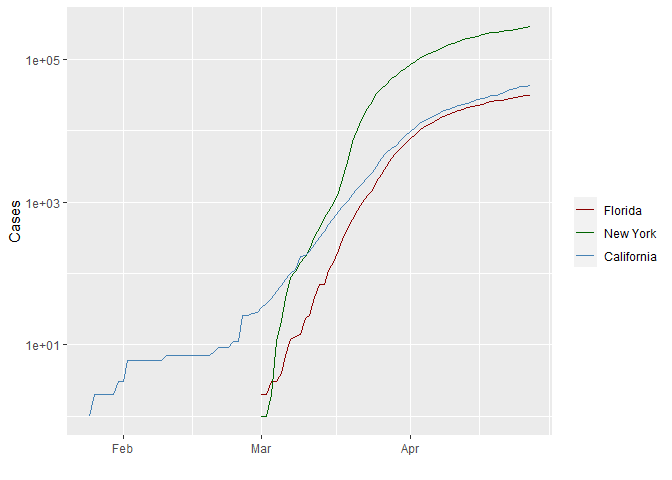
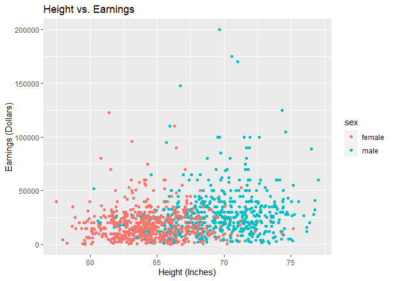

EXERCISE 7
================
Taniya Adhikari
2020-09-26

# Markdown Basics

## Favorite Foods

1.  Korean BBQ
2.  Japanese Ramen bowl
3.  Nepalese Momos

## Images

## Add a Quote

> “You came her empty-handed, and you will leave empty-handed.What is
> yours today belonged to someone else yesterday, and will belong to
> someone else tomorrow.”

## Add an Equation

We say that the limit of \(f(x)\) is \(L\) as \(x\) approaches \(a\) and
write this as  
\[\lim_{x\to a}f(x)=L\]

## Add a Footnote

provided we can make \(f(x)\) as close to \(L\) as we want for all \(x\)
sufficiently close to \(a\), both sides, without letting \(x\) be
\(a\).\[1\]

## Add Citations

  - R for Everyone Lander (2014)
  - Discovering Statistics Using R Field, Miles, and Field (2012)

# Inline Code

## NY Times COVID-19 Data

<!-- -->

## R4DS Height vs Earnings

<!-- -->

# Tables

## Knitr Table with Kable

| name      | race   | in\_fellowship | ring\_bearer |  age |
| :-------- | :----- | :------------- | :----------- | ---: |
| Aragon    | Men    | TRUE           | FALSE        |   88 |
| Bilbo     | Hobbit | FALSE          | TRUE         |  129 |
| Frodo     | Hobbit | TRUE           | TRUE         |   51 |
| Galadriel | Elf    | FALSE          | FALSE        | 7000 |
| Sam       | Hobbit | TRUE           | TRUE         |   36 |
| Gandalf   | Maia   | TRUE           | TRUE         | 2019 |
| Legolas   | Elf    | TRUE           | FALSE        | 2931 |
| Sauron    | Maia   | FALSE          | TRUE         | 7052 |
| Gollum    | Hobbit | FALSE          | TRUE         |  589 |

One Ring to Rule Them All

## Pandoc Table

| Name   | Race   | In Fellowship? | Is Ring Bearer? | Age  |
| :----- | :----- | :------------- | :-------------- | :--- |
| Argon  | Men    | Yes            | No              | 88   |
| Bilbo  | Hobbit | No             | Yes             | 129  |
| Frodo  | Hobbit | Yes            | Yes             | 51   |
| Sam    | Hobbit | Yes            | Yes             | 36   |
| Sauron | Maia   | No             | Yes             | 7052 |

Pandoc Table

# References

Field, A., J. Miles, and Z. Field. 2012. *Discovering Statistics Using
R*. SAGE Publications. <https://books.google.com/books?id=wd2K2zC3swIC>.

Lander, J. P. 2014. *R for Everyone: Advanced Analytics and Graphics*.
Addison-Wesley Data and Analytics Series. Addison-Wesley.
<https://books.google.com/books?id=3eBVAgAAQBAJ>.

1.  This is the Definition of limit
