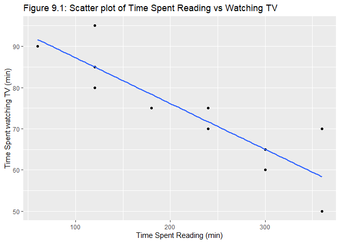
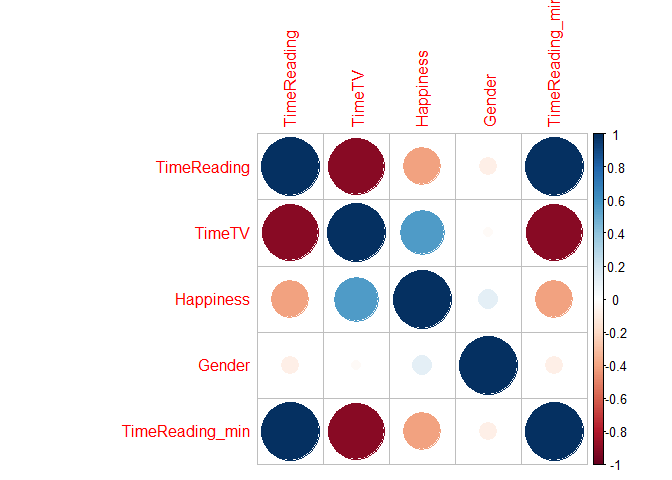
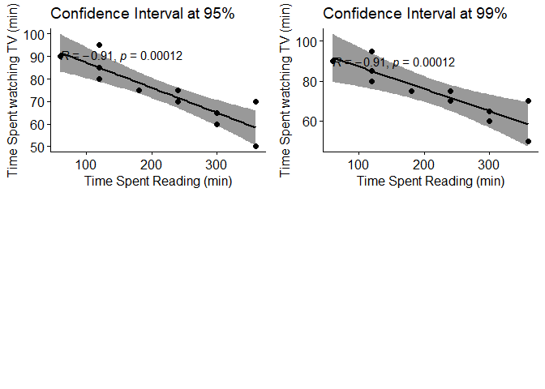
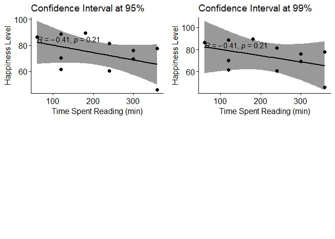
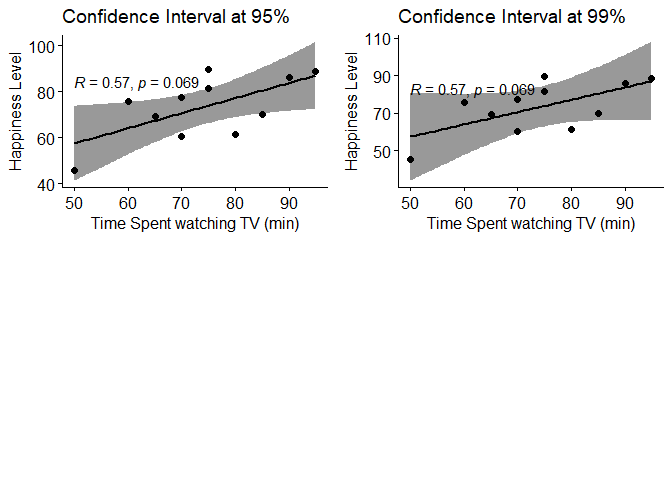

Exercise 09 Student Survey
================
Taniya Adhikari
10/3/2020

Importing the dataset

| TimeReading | TimeTV | Happiness | Gender |
| ----------: | -----: | --------: | -----: |
|           1 |     90 |     86.20 |      1 |
|           2 |     95 |     88.70 |      0 |
|           2 |     85 |     70.17 |      0 |
|           2 |     80 |     61.31 |      1 |
|           3 |     75 |     89.52 |      1 |

Table 9.1: A table of the Dataset with first 5 values.

**a. Use R to calculate the covariance of the Survey variables and
provide an explanation of why you would use this calculation and what
the results indicate.**

**Answer a.**

``` r
kable(cov(survey_df),caption = "Table 9.2: Covariance of variables.")
```

|             |  TimeReading |       TimeTV |   Happiness |      Gender |
| :---------- | -----------: | -----------: | ----------: | ----------: |
| TimeReading |    3.0545455 | \-20.3636364 | \-10.350091 | \-0.0818182 |
| TimeTV      | \-20.3636364 |  174.0909091 |  114.377273 |   0.0454545 |
| Happiness   | \-10.3500909 |  114.3772727 |  185.451422 |   1.1166364 |
| Gender      |  \-0.0818182 |    0.0454545 |    1.116636 |   0.2727273 |

Table 9.2: Covariance of variables.

Covariance is a good way to show how two variables are related with
respect to its mean. Meaning if one variable deviates from its mean,
then other variable should also change in similar way, i.e positive or
negative. A positive covariance means both variable deviates from the
mean in same direction and a negative covariance means that both
variable deviates from the mean in opposite direction.

In the above table, a positive covariance between **TimeTV** and
**Happiness** indicates that as the Time spent watching TV increases,
the Happiness level also increases both deviates in the same direction.
A negative covariance between **TimeReading** and **TimeTV** indicates
that as the time spent on reading increases, time spent on watching tv
decreases both deviates in opposite direction.

**b. Examine the Survey data variables. What measurement is being used
for the variables? Explain what effect changing the measurement being
used for the variables would have on the covariance calculation. Would
this be a problem? Explain and provide a better alternative if needed.**

**Answer b.**

In **Table 9.1**  
1\. TimeReading is in hours and continuous variable.  
2\. TimeTV is in minutes and continuous variable.  
3\. Happiness is an integer and discrete variable with unknown
measurment unit.  
4\. Gender is a binary variable with 0 or 1 is either male or female.

**TimeReading and TimeTV spent are not in same scale of measurement.**

``` r
## converting the TimeReading variable 
survey_df$TimeReading_min <- survey_df$TimeReading * 60
kable(head(survey_df,5),caption = "Table 9.3: A table of the Dataset with first 5 values.")
```

| TimeReading | TimeTV | Happiness | Gender | TimeReading\_min |
| ----------: | -----: | --------: | -----: | ---------------: |
|           1 |     90 |     86.20 |      1 |               60 |
|           2 |     95 |     88.70 |      0 |              120 |
|           2 |     85 |     70.17 |      0 |              120 |
|           2 |     80 |     61.31 |      1 |              120 |
|           3 |     75 |     89.52 |      1 |              180 |

Table 9.3: A table of the Dataset with first 5 values.

``` r
kable(cov(survey_df),caption = "Table 9.4: Covariance of variables with measurement change.")
```

|                  |  TimeReading |         TimeTV |    Happiness |      Gender | TimeReading\_min |
| :--------------- | -----------: | -------------: | -----------: | ----------: | ---------------: |
| TimeReading      |    3.0545455 |   \-20.3636364 |  \-10.350091 | \-0.0818182 |       183.272727 |
| TimeTV           | \-20.3636364 |    174.0909091 |   114.377273 |   0.0454545 |    \-1221.818182 |
| Happiness        | \-10.3500909 |    114.3772727 |   185.451422 |   1.1166364 |     \-621.005455 |
| Gender           |  \-0.0818182 |      0.0454545 |     1.116636 |   0.2727273 |       \-4.909091 |
| TimeReading\_min |  183.2727273 | \-1221.8181818 | \-621.005455 | \-4.9090909 |     10996.363636 |

Table 9.4: Covariance of variables with measurement change.

The covariance is a good way to check the nature of relationship between
the variables, i.e positive or negative. However, covariance is not the
best measure for relationship because it changes as the scale of
measurement changes. In the above table, I compared TimeReading in hours
with TimeTV in minutes and TimeReading in minutes with TimeTV in
minutes, the covariance changed from -20.36 to -1221.82, but the nature
of relationship didn’t change. Therefore Covariance cannot be compared
with data in different scales.

Covariance can be used if all the variables were measured in same units,
but when variables cannot be converted in same scale (such as Happiness
cannot be converted into minutes) covariance cannot be used. A better
way is to standardize it where any scale of measurement is converted. A
correlation coefficient is a better measurement of relationship between
the two variables.

``` r
kable(cor(survey_df),caption = "Table 9.5: Correlation coefficient of variables with measurement change.")
```

|                  | TimeReading |      TimeTV |   Happiness |      Gender | TimeReading\_min |
| :--------------- | ----------: | ----------: | ----------: | ----------: | ---------------: |
| TimeReading      |   1.0000000 | \-0.8830677 | \-0.4348663 | \-0.0896421 |        1.0000000 |
| TimeTV           | \-0.8830677 |   1.0000000 |   0.6365560 |   0.0065967 |      \-0.8830677 |
| Happiness        | \-0.4348663 |   0.6365560 |   1.0000000 |   0.1570118 |      \-0.4348663 |
| Gender           | \-0.0896421 |   0.0065967 |   0.1570118 |   1.0000000 |      \-0.0896421 |
| TimeReading\_min |   1.0000000 | \-0.8830677 | \-0.4348663 | \-0.0896421 |        1.0000000 |

Table 9.5: Correlation coefficient of variables with measurement change.

Above table shows the correlation coefficient does not change as the
scale of measurement changes.

**c. Choose the type of correlation test to perform, explain why you
chose this test, and make a prediction if the test yields a positive or
negative correlation?**

**Answer c.**

    ## 
    ##  Pearson's product-moment correlation
    ## 
    ## data:  survey_df$TimeReading_min and survey_df$TimeTV
    ## t = -5.6457, df = 9, p-value = 0.0003153
    ## alternative hypothesis: true correlation is not equal to 0
    ## 95 percent confidence interval:
    ##  -0.9694145 -0.6021920
    ## sample estimates:
    ##        cor 
    ## -0.8830677

    ## 
    ##  Spearman's rank correlation rho
    ## 
    ## data:  survey_df$TimeReading_min and survey_df$TimeTV
    ## S = 419.6, p-value = 5.761e-05
    ## alternative hypothesis: true rho is less than 0
    ## sample estimates:
    ##        rho 
    ## -0.9072536

    ## 
    ##  Kendall's rank correlation tau
    ## 
    ## data:  survey_df$TimeReading_min and survey_df$TimeTV
    ## z = -3.2768, p-value = 0.0005249
    ## alternative hypothesis: true tau is less than 0
    ## sample estimates:
    ##        tau 
    ## -0.8045404

To choose the test between parametric and non-parametric, I would check
the sample size and normality.

    ## 'data.frame':    11 obs. of  5 variables:
    ##  $ TimeReading    : int  1 2 2 2 3 4 4 5 5 6 ...
    ##  $ TimeTV         : int  90 95 85 80 75 70 75 60 65 50 ...
    ##  $ Happiness      : num  86.2 88.7 70.2 61.3 89.5 ...
    ##  $ Gender         : int  1 0 0 1 1 1 0 1 0 0 ...
    ##  $ TimeReading_min: num  60 120 120 120 180 240 240 300 300 360 ...

    ##                         V1           V2
    ## median        2.400000e+02  75.00000000
    ## mean          2.181818e+02  74.09090909
    ## SE.mean       3.161755e+01   3.97824663
    ## CI.mean.0.95  7.044829e+01   8.86408589
    ## var           1.099636e+04 174.09090909
    ## std.dev       1.048635e+02  13.19435141
    ## coef.var      4.806246e-01   0.17808327
    ## skewness     -2.533230e-03  -0.11848577
    ## skew.2SE     -1.917116e-03  -0.08966855
    ## kurtosis     -1.642179e+00  -1.03762883
    ## kurt.2SE     -6.417691e-01  -0.40550884
    ## normtest.W    9.209289e-01   0.98680678
    ## normtest.p    3.264525e-01   0.99233227

Although, central limit theorem suggests that data becomes normal as it
gets bigger. The Pearson correlation coefficient test is not ideal for
such small sample size (n=11), as it’s violating the normality
assumption (skew and kurtosis is not 0). For Pearson correlation
coefficient \(r\) to be significant, sample size has to be large enough
(n \(\geq\) 30). \(r\) changes as the sample size gets bigger. Kendall’s
\(\tau\) is probably not the ideal test either, because we don’t have
large number of tied ranks.

I will use Spearman’s \(r_{s}\) because it is similar to Pearson
coefficient \(r\) but works with ranks and works better for smaller
sample size. Spearman works for both normal and non-normal distribution.
The p-value is also smaller compared to other two tests.

All Tests shows there is significant strong negative
relationship/association between the two variables. Spearman’s \(r_{s}\)
suggests significant monotonic association between the ranks of two
variables(\(r_{s} = -.907\)) the Pearson correlation also suggests
strong negative relationship (\(r = -.88\)) and Kendall test
(\(\tau = -.80\)) also suggests strong association of rank.

This means as the Time spent reading increases, the Time spent watching
TV decreases. Below graph also suggests the same thing.

<!-- -->

**d. Perform a correlation analysis of:**  
**1. All variables**  
**2. A single correlation between two a pair of the variables**  
**3. Repeat your correlation test in step 2 but set the confidence
interval at 99%**  
**4. Describe what the calculations in the correlation matrix suggest
about the relationship between the variables. Be specific with your
explanation.**

**Answer d**

**1.**

|                  | TimeReading |      TimeTV |   Happiness |      Gender | TimeReading\_min |
| :--------------- | ----------: | ----------: | ----------: | ----------: | ---------------: |
| TimeReading      |   1.0000000 | \-0.9072536 | \-0.4065196 | \-0.0880141 |        1.0000000 |
| TimeTV           | \-0.9072536 |   1.0000000 |   0.5662159 | \-0.0289996 |      \-0.9072536 |
| Happiness        | \-0.4065196 |   0.5662159 |   1.0000000 |   0.1154701 |      \-0.4065196 |
| Gender           | \-0.0880141 | \-0.0289996 |   0.1154701 |   1.0000000 |      \-0.0880141 |
| TimeReading\_min |   1.0000000 | \-0.9072536 | \-0.4065196 | \-0.0880141 |        1.0000000 |

Table 9.6: Spearman Correlation coefficient of variables

**Figure 9.2: Correlation Plot of Variables**

<!-- -->

###### For this assignment I will be using Spearman correlation coefficient.

**2.**

**Spearman Correlation Test of Time spent reading vs. Time spent
watching TV**

    ## 
    ##  Spearman's rank correlation rho
    ## 
    ## data:  survey_df$TimeReading_min and survey_df$TimeTV
    ## S = 419.6, p-value = 5.761e-05
    ## alternative hypothesis: true rho is less than 0
    ## sample estimates:
    ##        rho 
    ## -0.9072536

**Spearman Correlation Test of Time spent reading vs. Happiness level**

    ## 
    ##  Spearman's rank correlation rho
    ## 
    ## data:  survey_df$TimeReading_min and survey_df$Happiness
    ## S = 309.43, p-value = 0.1074
    ## alternative hypothesis: true rho is less than 0
    ## sample estimates:
    ##        rho 
    ## -0.4065196

**Spearman Correlation Test of Time spent watching TV vs. Happiness
level**

    ## 
    ##  Spearman's rank correlation rho
    ## 
    ## data:  survey_df$TimeTV and survey_df$Happiness
    ## S = 95.432, p-value = 0.9653
    ## alternative hypothesis: true rho is less than 0
    ## sample estimates:
    ##       rho 
    ## 0.5662159

**3.**

**Spearman Correlation Test of Time spent reading vs. Time spent
watching TV with Confidence level of 99%**

    ## 
    ##  Spearman's rank correlation rho
    ## 
    ## data:  survey_df$TimeReading_min and survey_df$TimeTV
    ## S = 419.6, p-value = 5.761e-05
    ## alternative hypothesis: true rho is less than 0
    ## sample estimates:
    ##        rho 
    ## -0.9072536

**Figure 9.3: Confidence level graph for Time spent reading vs. Time
spent watching TV**

<!-- -->

**Spearman Correlation Test of Time spent reading vs. Happiness with
Confidence level of 99%**

    ## 
    ##  Spearman's rank correlation rho
    ## 
    ## data:  survey_df$TimeReading_min and survey_df$Happiness
    ## S = 309.43, p-value = 0.1074
    ## alternative hypothesis: true rho is less than 0
    ## sample estimates:
    ##        rho 
    ## -0.4065196

**Fig 9.4: Confidence level graph for Time spent reading vs. Happiness
level**

<!-- -->

**Spearman Correlation Test of Time spent watching TV vs. Happiness with
Confidence level of 99%**

    ## 
    ##  Spearman's rank correlation rho
    ## 
    ## data:  survey_df$TimeTV and survey_df$Happiness
    ## S = 95.432, p-value = 0.9653
    ## alternative hypothesis: true rho is less than 0
    ## sample estimates:
    ##       rho 
    ## 0.5662159

**Figure 9.5: Confidence level graph for Time spent watching TV
vs. Happiness level**

<!-- -->

**4.**

Using Table 9.6 there is a significant strong negative relationship
between TimeReading and TimeTV with Spearman \(r_{s} = -.91\). There is
a significant moderate negative relationship between TimeReading and
Happiness with Spearman \(r_{s} = -.41\).There is a significant positive
relationship between TimeTV and Happiness with Spearman \(r_{s} = .57\).

This means as students spend more time reading, they will also decrease
their time watching TV and their happiness level also decreases. And as
students spend more time watching TV they are more likely to be happier.

**e. Calculate the correlation coefficient and the coefficient of
determination, describe what you conclude about the results.**

**Answer e**

    ## [1] -0.9072536

    ## [1] 0.8231091

The spearman correlation coefficient \(r_{s} = -0.91\) and correlation
of determination \(r_{s}^2 = 0.82\). The \(r_{s}^2\) is the variation in
the ranks of the two variables. This means that Time spent Reading is
highly correlated with Time spent watching TV and it can account for 82%
of the variation in Time spent watching TV.

**f. Based on your analysis can you say that watching more TV caused
students to read less? Explain.**

**Answer f**

Yes, The relationship between the two are in negative direction, the
relationship is strong because of \(r_{s} = -0.91\) and the significance
value is \(p = 0.00005761\) is less than .05 which means watching more
TV causes students to read less.

**g. Pick three variables and perform a partial correlation, documenting
which variable you are “controlling”. Explain how this changes your
interpretation and explanation of the results.**

**Answer g**

In Table 9.6, we know that TimeReading is negatively related to TimeTV
and TimeTV is positively related to Happiness, but Happiness is
negatively related to TimeReading. So for partial correlation I choose
the Happiness as a control variable to measure the pure relationship
between TimeReading and TimeTV.

###### For this part of the question I will be using Pearson correlation coefficient for comparison. I couldn’t find a way to do partial correlation in spearman test.

The following code gave me the output:

> pc \<- pcor(c(“TimeReading\_min”, “TimeTV”, “Happiness”),
> var(survey\_df))  
> pc^2  
> \[1\] 0.762033  
> pc  
> \[1\] -0.872945  
> pcor.test(pc,1,11)

$tval  
\[1\] -5.061434

$df  
\[1\] 8

$pvalue  
\[1\] 0.0009753126

The \(r\) actually reduced from -.88 to -.87 and r-squared got reduced
from 0.78 to 0.76. Although, the correlation still seems significant,
the correlation between the two variables is decreased. Before the
partial correlation, the effects of Happines, the TimeReading and TimeTV
spent shared a 78% of the variation. Now it is reduced by 2%. This
explains that Time spent Reading alone still shares higher variation in
Time spent watching TV
