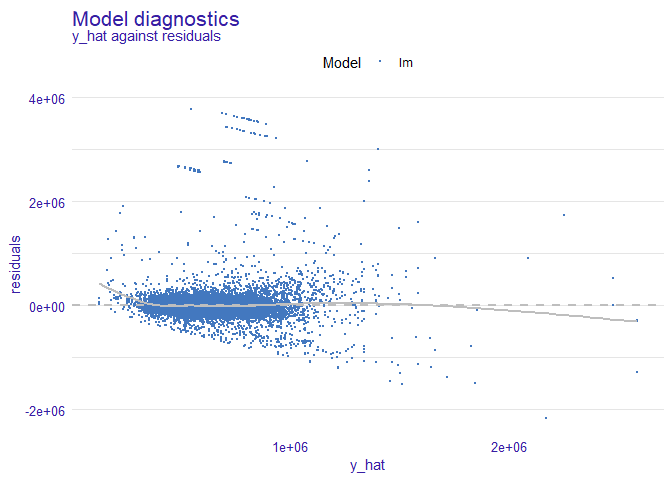
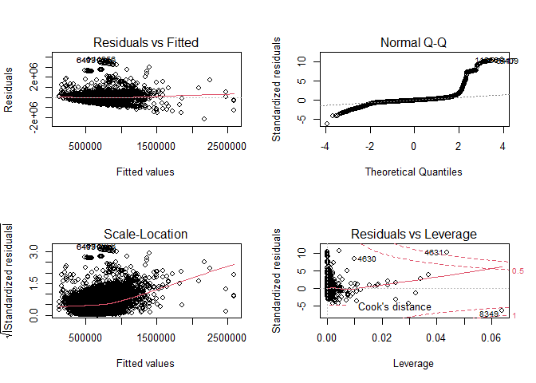
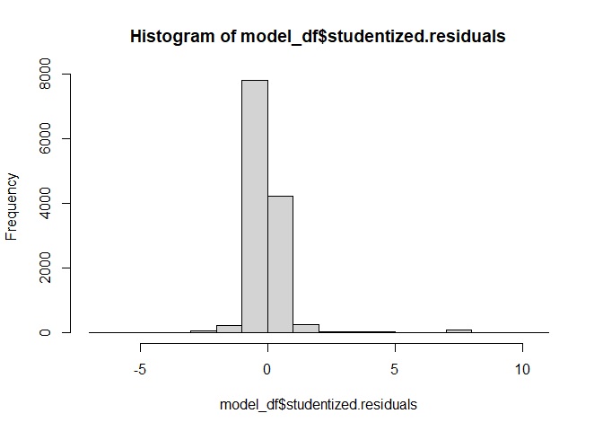
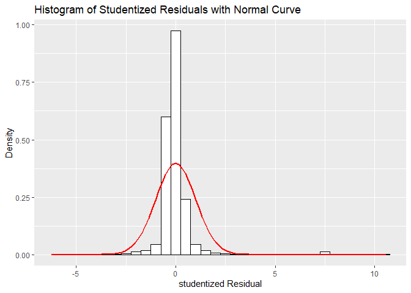
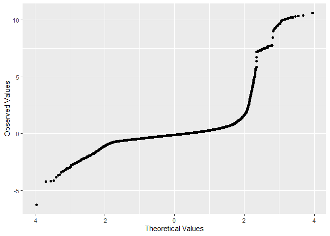
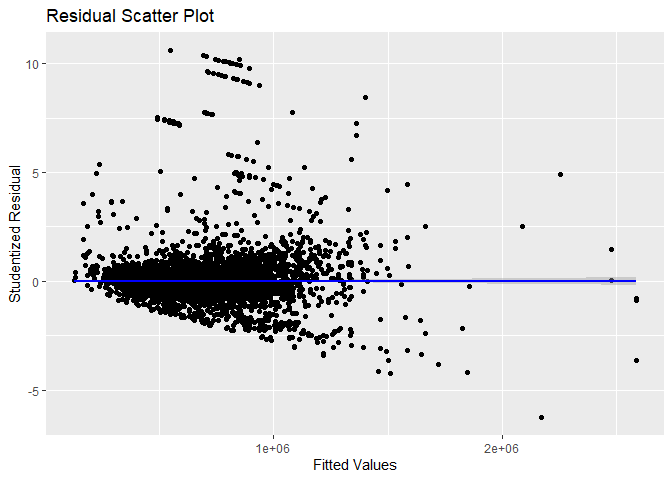

Exercise 12
================
Taniya Adhikari
10/3/2020

Importing the dataset

We have 24 variables in this dataframe.

1.  **Sale Date** which is in date format. Can be considered as
    qualitative data and referred to the sale date of the house.  
2.  **Sale Price** is a quantitative and continuous variable and is
    refereed to sale price of the house.  
3.  **sale\_reason** is integer but is a nominal and qualitative
    variable , referred to the reason of selling the house.  
4.  **sale\_instrument** is integer but is a nominal and qualitative
    variable.  
5.  **sale\_warning** is NA means it’s missing values, seems like a
    qualitative variable.  
6.  **sitetype** is a qualitative variable, referred to the type of
    site.  
7.  **addr\_full** is a qualitative variable referred to the address of
    the house.  
8.  **zip5** is integer but it is a qualitative and ordinal variable
    because it’s a zip code of the house location.  
9.  **ctyname** is a qualitative variable and the city of house.  
    10\.**postalctyn** is a postal city name and a qualitative
    variable.  
    11\.**lon** is integer but qualitative and nominal variable and
    referred to the longitude coordinates.  
    12\.**lat** is integer but qualitative and nominal variable and
    referred to the latitude coordinates.  
    13\.**building\_grade** is integer but qualitative and ordinal
    variable.  
    14\.**square\_feet\_total\_living** is quantitative continuous
    variable and referred to the size of the house in square ft.  
    15\.**bedrooms** is quantitative discrete variable and referred to
    the number of bedrooms in the house.  
    16\.**bath\_full\_count** is quantitative discrete variable and
    referred to the number of full bathrooms in the house.  
    17\.**bath\_half\_count** is quantitative discrete variable and
    referred to the number of half bathrooms in the house.  
    18\.**bath\_3qtr\_count** is quantitative discrete variable and
    referred to the number of 3qtr bathrooms in the house.  
    19\.**year\_built** is quantitative discrete variable and referred
    to the year of house built.  
    20\.**year\_renovated** is quantitative discrete variable and
    referred to the year of house was renovated with 0 being not
    renovated.  
    21\.**current\_zoning** is a qualitative variable, referred to the
    type of zoning.  
    22\.**sq\_ft\_lot** is quantitative continuous variable and referred
    to the size of the total lot in square ft.  
    23\.**prop\_type** is a qualitative variable, referred to the
    property type.  
    24\.**present\_use** is a quantitative variable not sure what it is
    referred to.

**Now that we have establish the type of variables, I will be performing
doing some of the EDA steps to clean the data**

**Dealing with Missing Values or Duplicate values**

**a. Explain why you chose to remove data points from your ‘clean’
dataset.**

**Answer a**  
First I removed the variables that has lot of missing values i.e
**sale\_warning** and **ctyname**. Usually for missing values rows are
removed instead of the whole variable, but in this case, deleting rows
will cause loss of data points that are significant. Then I removed any
duplicate values by keeping the distinct or unique values for each
columns.Finally, I removed following variables:  
a. **addr\_full**: they are unique home addresses for each sale (some
were repeated because same house was sold more than once) but they are
still unique, so it is neither categorical nor numerical data.  
b. **zip5**: they are also referred to the zipcode of the city where the
housing data belong to, adds little value to the sale price.  
c. **postalctyn**: is a Level 1 variable with only single value in it.  
d. **lon & lat**: I removed longitudes and latitudes coordinates because
it is also the conversion of house location, also unique for each house
address.  
e. **prop\_type**: Removed it because it consists of only one value.

**b.Create two variables; one that will contain the variables Sale Price
and Square Foot of Lot (same variables used from previous assignment on
simple regression) and one that will contain Sale Price and several
additional predictors of your choice. Explain the basis for your
additional predictor selections.**

**Answer b**  
Theoretically, Square ft of the lot, size of the house, Number of
bedrooms and Number of bathrooms in a house, age of the house, year
built and maintenance can affect the price of the house. First, I built
a test model and applied stepwise regression to choose the list of
important variables for the model

Then I check for assumptions and removed any variables that didn’t meet
assumptions.  
All Variables are either categorical or quantitative and has non-zero
variance.

For assumption 2, I kept the threshold of 0.5 if r was above 0.5 then I
would assume that the two predictor variables are highly correlated.
Variables square\_feet\_total\_living and building\_grade has higher
linearity, so I check for beta coefficient and found building\_grade has
lower coefficient so I removed that variable.

My Model is violating homoscedasticity, so I will have to further
analyze the model.

Following this I used beta coefficient to pick the important predictor
variables and removed variables with weaker coefficients (including
negative coefficient.

My final Model is:

*Sale.Price = -5570635.55907 + 163.82704(square\_feet\_total\_living) +
2925.72914(year\_built) + 0.34373(sq\_ft\_lot)*

**c. Execute a summary() function on two variables defined in the
previous step to compare the model results. What are the R2 and Adjusted
R2 statistics? Explain what these results tell you about the overall
model. Did the inclusion of the additional predictors help explain any
large variations found in Sale Price?**

    ## 
    ## Call:
    ## lm(formula = Sale.Price ~ sq_ft_lot, data = clean_df)
    ## 
    ## Residuals:
    ##      Min       1Q   Median       3Q      Max 
    ## -2007639  -194855   -63630    91632  3735260 
    ## 
    ## Coefficients:
    ##              Estimate Std. Error t value Pr(>|t|)    
    ## (Intercept) 6.417e+05  3.808e+03  168.52   <2e-16 ***
    ## sq_ft_lot   8.459e-01  6.224e-02   13.59   <2e-16 ***
    ## ---
    ## Signif. codes:  0 '***' 0.001 '**' 0.01 '*' 0.05 '.' 0.1 ' ' 1
    ## 
    ## Residual standard error: 401700 on 12823 degrees of freedom
    ## Multiple R-squared:  0.0142, Adjusted R-squared:  0.01412 
    ## F-statistic: 184.7 on 1 and 12823 DF,  p-value: < 2.2e-16

    ## 
    ## Call:
    ## lm(formula = Sale.Price ~ square_feet_total_living + year_built + 
    ##     sq_ft_lot, data = clean_df)
    ## 
    ## Residuals:
    ##      Min       1Q   Median       3Q      Max 
    ## -2154957  -120194   -41342    46053  3761515 
    ## 
    ## Coefficients:
    ##                            Estimate Std. Error t value Pr(>|t|)    
    ## (Intercept)              -5.562e+06  3.909e+05 -14.228  < 2e-16 ***
    ## square_feet_total_living  1.659e+02  3.504e+00  47.357  < 2e-16 ***
    ## year_built                2.908e+03  1.975e+02  14.720  < 2e-16 ***
    ## sq_ft_lot                 2.914e-01  5.846e-02   4.985 6.28e-07 ***
    ## ---
    ## Signif. codes:  0 '***' 0.001 '**' 0.01 '*' 0.05 '.' 0.1 ' ' 1
    ## 
    ## Residual standard error: 357600 on 12821 degrees of freedom
    ## Multiple R-squared:  0.219,  Adjusted R-squared:  0.2188 
    ## F-statistic:  1198 on 3 and 12821 DF,  p-value: < 2.2e-16

**Answer c** Comparing Model 1 to Model 2. R-squared and Adjusted
R-Squared increased with the inclusion of additional predictors. Overall
Model, the change of \(R^2\) is significant. Since the real estate
appreciates over time and size of the house also matters, adding more
variables helped in undertanding Sale Prices.

**Model 1**  
\[r^2 = 0.0142\]  
\[r^2* = 0.01412\]

**Model 2**  
\[r^2 = 0.219\]  
\[r^2* = 0.2188\]

**d. Considering the parameters of the multiple regression model you
have created. What are the standardized betas for each parameter and
what do the values indicate?**

``` r
## calculating beta coefficients
lm.beta(RegModel.2)
```

    ## square_feet_total_living               year_built                sq_ft_lot 
    ##               0.40591572               0.12381881               0.04105345

**Answer d**  
A standardized beta coefficient compares the strength of the effect of
each individual independent variable to the dependent variable. The
higher the absolute value of the beta coefficient, the stronger the
effect.

**square\_feet\_total\_living** has the highest absolute value of beta
coefficient indicating strongest effect, **year\_built** has the second
highest beta coefficient indicating has the moderate effect on the
dependent variable and **sq\_ft\_lot** has the lowest beta coefficient
indicating weakest effect on dependent variables.

**e. Calculate the confidence intervals for the parameters in your model
and explain what the results indicate.**

``` r
confint(RegModel.2)
```

    ##                                  2.5 %        97.5 %
    ## (Intercept)              -6.328466e+06 -4.795874e+06
    ## square_feet_total_living  1.590801e+02  1.728176e+02
    ## year_built                2.520471e+03  3.294828e+03
    ## sq_ft_lot                 1.768308e-01  4.060168e-01

**Answer e**  
The above confidence interval indicates that the estimates of the
current model likely to represent true population values. The 95% of
these samples boundaries will contain the true value of *b*. Since, none
of the confidence interval crosses zero it is safe to say it is a
significant model.

**f. Assess the improvement of the new model compared to your original
model (simple regression model) by testing whether this change is
significant by performing an analysis of variance.**

``` r
## Anova test for Model 1
AnovaModel.1<-aov(RegModel.1)
summary(AnovaModel.1)
```

    ##                Df    Sum Sq   Mean Sq F value Pr(>F)    
    ## sq_ft_lot       1 2.981e+13 2.981e+13   184.7 <2e-16 ***
    ## Residuals   12823 2.070e+15 1.614e+11                   
    ## ---
    ## Signif. codes:  0 '***' 0.001 '**' 0.01 '*' 0.05 '.' 0.1 ' ' 1

``` r
## Anova test for Model 2
AnovaModel.2<-aov(RegModel.2)
summary(AnovaModel.2)
```

    ##                             Df    Sum Sq   Mean Sq F value   Pr(>F)    
    ## square_feet_total_living     1 4.316e+14 4.316e+14 3374.81  < 2e-16 ***
    ## year_built                   1 2.492e+13 2.492e+13  194.87  < 2e-16 ***
    ## sq_ft_lot                    1 3.178e+12 3.178e+12   24.85 6.28e-07 ***
    ## Residuals                12821 1.640e+15 1.279e+11                     
    ## ---
    ## Signif. codes:  0 '***' 0.001 '**' 0.01 '*' 0.05 '.' 0.1 ' ' 1

**Answer f**  
The p-value for Model 1 is less that 0.001 percent, indicating that
sq\_ft\_lot impact the sale price. However, in two-way ANOVA of Model 2
indicates square\_feet\_total\_living and year\_built has higher impact
compared to sq\_ft\_lot in multiple regression model with p-values
significantly lower. It is also possible to that independent variables
have interaction effect rather than additive. To check this:

``` r
## checking for variable interactions
AnovaModel.3<-aov(formula = Sale.Price ~ square_feet_total_living*year_built*sq_ft_lot, data = clean_df)
summary(AnovaModel.3)
```

    ##                                                  Df    Sum Sq   Mean Sq
    ## square_feet_total_living                          1 4.316e+14 4.316e+14
    ## year_built                                        1 2.492e+13 2.492e+13
    ## sq_ft_lot                                         1 3.178e+12 3.178e+12
    ## square_feet_total_living:year_built               1 1.123e+11 1.123e+11
    ## square_feet_total_living:sq_ft_lot                1 5.642e+12 5.642e+12
    ## year_built:sq_ft_lot                              1 3.750e+12 3.750e+12
    ## square_feet_total_living:year_built:sq_ft_lot     1 1.523e+12 1.523e+12
    ## Residuals                                     12817 1.629e+15 1.271e+11
    ##                                                F value   Pr(>F)    
    ## square_feet_total_living                      3396.601  < 2e-16 ***
    ## year_built                                     196.124  < 2e-16 ***
    ## sq_ft_lot                                       25.010 5.78e-07 ***
    ## square_feet_total_living:year_built              0.883 0.347277    
    ## square_feet_total_living:sq_ft_lot              44.405 2.78e-11 ***
    ## year_built:sq_ft_lot                            29.510 5.67e-08 ***
    ## square_feet_total_living:year_built:sq_ft_lot   11.989 0.000537 ***
    ## Residuals                                                          
    ## ---
    ## Signif. codes:  0 '***' 0.001 '**' 0.01 '*' 0.05 '.' 0.1 ' ' 1

In the output, the square\_feet\_total\_living:year\_built has a high
p-value, which indicates there is not much variation that can be
explained by the interaction of square\_feet\_total\_living and
year\_built.

**g. Perform casewise diagnostics to identify outliers and/or
influential cases, storing each function’s output in a dataframe
assigned to a unique variable name.**

**Answer g**  
I created another dataframe name Model\_df with just the variables from
my model 2, Sale.Price, square\_feet\_total\_living, year\_built and
sq\_ft\_lot to add casewise diagnostics variables.

``` r
square_feet_total_living <-clean_df$square_feet_total_living
year_built <- clean_df$year_built
sq_ft_lot <- clean_df$sq_ft_lot
Sale.Price <- clean_df$Sale.Price

model_df <-data.frame("Sale.Price" = Sale.Price, "square_feet_total_living" = square_feet_total_living, "year_built" = year_built, "sq_ft_lot" = sq_ft_lot)

## casewise diagnostics

## Outliers detection - Residuals
model_df$residuals<-resid(RegModel.2)
model_df$standardized.residuals<- rstandard(RegModel.2)
model_df$studentized.residuals<-rstudent(RegModel.2)

## Influential cases
model_df$cooks.distance<-cooks.distance(RegModel.2)
model_df$dfbeta<-dfbeta(RegModel.2) 
model_df$dffit<-dffits(RegModel.2) 
model_df$leverage<-hatvalues(RegModel.2) 
model_df$covariance.ratios<-covratio(RegModel.2)
```

**h. Calculate the standardized residuals using the appropriate command,
specifying those that are +-2, storing the results of large residuals in
a variable you create.**

**Answer h**

``` r
model_df$standardized.residuals > 2 | model_df$standardized.residuals < -2
model_df$large.residual <- model_df$standardized.residuals > 2 | model_df$standardized.residuals < -2
```

**i. Use the appropriate function to show the sum of large residuals.**

**Answer i**

``` r
total_large_residuals <- sum(model_df$large.residual)
(total_large_residuals/nrow(model_df))*100
```

    ## [1] 2.604288

There are 334 cases which has large residuals out of n = 12825. Meaning
only 2.6% of cases are outside of the limits.

**j. Which specific variables have large residuals (only cases that
evaluate as TRUE)?**

**Answer j**

Below table shows first 6 values with large residuals

|     | Sale.Price | square\_feet\_total\_living | year\_built | sq\_ft\_lot | standardized.residuals |
| :-- | ---------: | --------------------------: | ----------: | ----------: | ---------------------: |
| 6   |     184667 |                        4160 |        2005 |        7280 |             \-2.168794 |
| 25  |     265000 |                        4920 |        2007 |      112650 |             \-2.399359 |
| 115 |    1390000 |                         660 |        1955 |      225640 |               3.057428 |
| 160 |     229000 |                        3840 |        2008 |      236966 |             \-2.108957 |
| 178 |     390000 |                        5800 |        2008 |       63162 |             \-2.426358 |
| 239 |    1588359 |                        3360 |        2005 |        8752 |               2.126905 |

    ## Preparation of a new explainer is initiated
    ##   -> model label       :  lm  (  default  )
    ##   -> data              :  12825  rows  16  cols 
    ##   -> data              :  tibble converted into a data.frame 
    ##   -> target variable   :  12825  values 
    ##   -> predict function  :  yhat.lm  will be used (  default  )
    ##   -> predicted values  :  numerical, min =  128006.4 , mean =  660501.8 , max =  2586855  
    ##   -> model_info        :  package stats , ver. 4.0.2 , task regression (  default  ) 
    ##   -> residual function :  difference between y and yhat (  default  )
    ##   -> residuals         :  numerical, min =  -2154957 , mean =  1.667561e-07 , max =  3761515  
    ##   A new explainer has been created! 

<!-- -->

**k. Investigate further by calculating the leverage, cooks distance,
and covariance rations. Comment on all cases that are problematics.**

**Answer k**

**Cooks Distance**

|      | Sale.Price | square\_feet\_total\_living | year\_built | sq\_ft\_lot |
| :--- | ---------: | --------------------------: | ----------: | ----------: |
| 4631 |    4400000 |                        2410 |        1935 |     1327090 |

There is one case where cooks distance (1.176) is greater than 1. The
sale price of this house is 440,000 but the sq\_ft\_lot is 132,7090
which looks abnormally higher.

**Average Leverage**

The average leverage(\(leverage = 4/n\)) calculated is 00.0003118908, so
3 times higher value is 0.0009356725. we are looking for values anything
greater than that. In the table below all values with Large Leverage is
at least 3 times greater than the calculated average leverage. That
means they are influential cases.

Below Table shows the first 6 values with Hat Values larger than
calculated average leverage.

|     | Sale.Price | square\_feet\_total\_living | year\_built | sq\_ft\_lot |  leverage |
| :-- | ---------: | --------------------------: | ----------: | ----------: | --------: |
| 14  |     165000 |                        1850 |        2011 |      278891 | 0.0023812 |
| 65  |     446400 |                        1770 |        1984 |      220654 | 0.0012556 |
| 72  |    1900000 |                        6610 |        1990 |       37017 | 0.0016667 |
| 92  |     732500 |                        5710 |        1977 |       10200 | 0.0013619 |
| 108 |    1520000 |                        4640 |        1952 |       19173 | 0.0013534 |
| 115 |    1390000 |                         660 |        1955 |      225640 | 0.0017372 |

**Covariance ratio**

The Covariance Ratio should be greater than \(1 +[3(k+1)/n]\) but if the
covariance ratio is less than \(1 -[3(k+1)/n]\) then deleting the case
will improve the precision of some of the model’s parameter. our
calculated covariance ratio is 0.9990643. Below is the table with all
the values less than the calculated CVR.

Below table shows the first 6 values with covariance ratio less than the
calculated covariance ratio threshold.

|     | Sale.Price | square\_feet\_total\_living | year\_built | sq\_ft\_lot | covariance.ratios |
| :-- | ---------: | --------------------------: | ----------: | ----------: | ----------------: |
| 239 |    1588359 |                        3360 |        2005 |        8752 |         0.9990588 |
| 246 |    1450000 |                         900 |        1918 |       14043 |         0.9978982 |
| 287 |     163000 |                        4710 |        2014 |       18498 |         0.9987532 |
| 295 |     270000 |                        5060 |        2016 |       89734 |         0.9990097 |
| 300 |     200000 |                        6880 |        2008 |      288367 |         0.9988500 |
| 385 |    2500000 |                        6310 |        2005 |       36362 |         0.9982213 |

**l. Perform the necessary calculations to assess the assumption of
independence and state if the condition is met or not.**

    ## Warning: package 'lmtest' was built under R version 4.0.3

    ## Loading required package: zoo

    ## Warning: package 'zoo' was built under R version 4.0.3

    ## 
    ## Attaching package: 'zoo'

    ## The following objects are masked from 'package:base':
    ## 
    ##     as.Date, as.Date.numeric

    ## 
    ##  Durbin-Watson test
    ## 
    ## data:  RegModel.2
    ## DW = 0.56099, p-value < 2.2e-16
    ## alternative hypothesis: true autocorrelation is greater than 0

Durbin-Watson Test is test for independence. There shouldn’t be any
autocorrelation. Any values less than 1 or greater than 3 is not favored
and is a concern. The above test indicates DW = 0.56099. Indicating that
there is an autocorrelation. Independence Assumption is violated.

**m. Perform the necessary calculations to assess the assumption of no
multicollinearity and state if the condition is met or not.**

    ##                          square_feet_total_living year_built  sq_ft_lot
    ## square_feet_total_living                1.0000000  0.3061434  0.2337053
    ## year_built                              0.3061434  1.0000000 -0.1353060
    ## sq_ft_lot                               0.2337053 -0.1353060  1.0000000

There is some correlation between the predictor variables. however,
typically anything above 0.5 is considered strong linear relationship,
and less than 0.5 is considered week relationship. In this case all the
variables has r less than 0.5.

**n. Visually check the assumptions related to the residuals using the
plot() and hist() functions. Summarize what each graph is informing you
of and if any anomalies are present.**

**Answer n**

<!-- --><!-- -->

<!-- -->

    ## Warning: `stat` is deprecated

<!-- -->

    ## `geom_smooth()` using formula 'y ~ x'

<!-- -->

The above residuals vs Fitted plot has a funnel shape indicating that
there is heteroscedasticity in the data. It also shows that it violated
the assumption of linearity.

The q-q plot shows up deviations from normality, the straight line
indicates normal distribution, the data set is violating the assumption
of normality.

The Histogram also shows that the residuals distribution is slightly
skewed and therefore not normal.

**o. Overall, is this regression model unbiased? If an unbiased
regression model, what does this tell us about the sample vs. the entire
population model?**

**Answer o**  
This model is definitely unbiased with multiple assumptions violated
(Normality, linearity, Independence). This model can only be used to
draw conclusions for sample only and cannot be generalized for
population. It either needs data transformation of Robust Regression.

**References**  
1\. <https://www.scribbr.com/statistics/anova-in-r/>  
2\. <https://www.scribbr.com/statistics/linear-regression-in-r/>  
3\.
<https://statisticsbyjim.com/regression/identifying-important-independent-variables/>  
4\. <https://www.homelight.com/blog/real-estate-property-value/>
