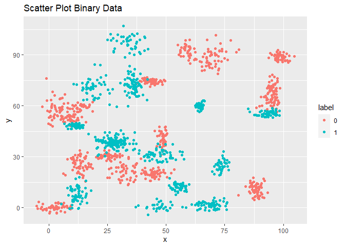
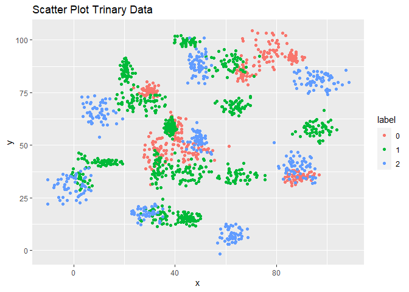
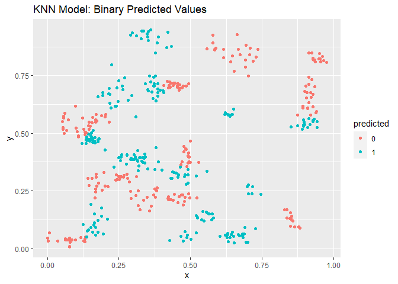
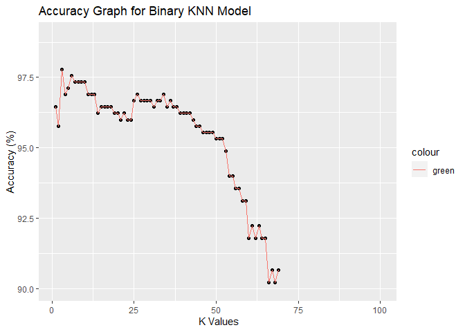
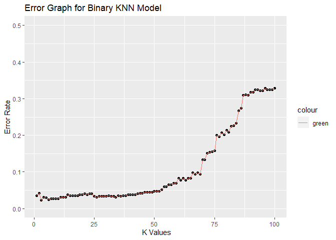
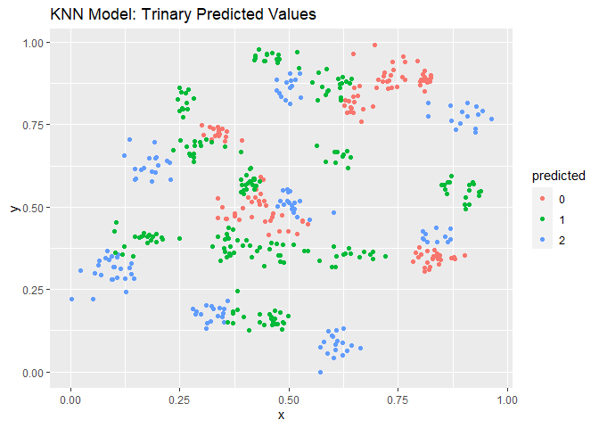
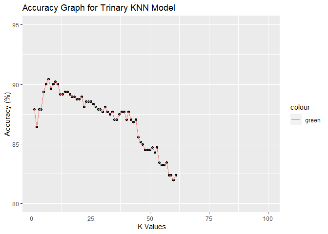
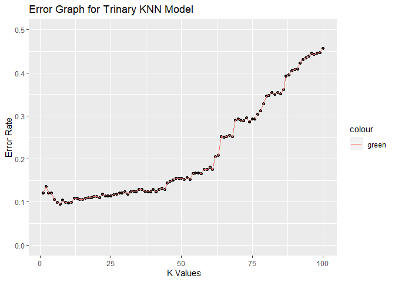

Exercise 15: Introduction to Machine Learning
================
Taniya Adhikari"
11/1/2020

Importing the dataset

``` r
library(tinytex)
library(knitr)
binary_df <- read.csv("data/binary-classifier-data.csv")
trinary_df <- read.csv("data/trinary-classifier-data.csv")
binary_df$label <- as.factor(binary_df$label)
trinary_df$label <- as.factor(trinary_df$label)
```

Plot the data from each dataset using a scatter plot.

``` r
library(ggplot2)
ggplot(data = binary_df, aes(x = x, y = y, color = label)) + 
  geom_point() + 
  ggtitle("Scatter Plot Binary Data")
```

<!-- -->

``` r
ggplot(data = trinary_df, aes(x = x, y = y, color = label)) + 
  geom_point() + 
  ggtitle("Scatter Plot Trinary Data")
```

<!-- -->

Fit a k nearest neighbors model for each dataset for k=3, k=5, k=10,
k=15, k=20, and k=25. Compute the accuracy of the resulting models for
each value of k. Plot the results in a graph where the x-axis is the
different values of k and the y-axis is the accuracy of the model.

Binary Dataset KNN Algorithm with k = 25.

``` r
library(class)
library(FNN)

knn.binary <- sample(1:nrow(binary_df),size=nrow(binary_df)*0.7,replace = FALSE)

## the normalization function is created
nor <-function(x) { (x -min(x))/(max(x)-min(x))   }

## Run normalization for predictor variables.
binary_norm <- as.data.frame(lapply(binary_df[,c(2,3)], nor))

train.binary <- binary_norm[knn.binary,] # 70% training data
test.binary <- binary_norm[-knn.binary,] # remaining 30% test data

## knn.dist calculates distance between two points. default method is euclidean. 
kdist_binary <- knn.dist(binary_norm)


## the creating dataframes for "credibility"
train.binarylabels <- binary_df[knn.binary,1]
test.binarylabels  <-binary_df[-knn.binary,1]

## knn function
model.binary =  knn(train=train.binary, test=test.binary, cl=train.binarylabels, kdist_binary, k=25)

## create confusion matrix
tab_binary <- table(model.binary,test.binarylabels)

## this function divides the correct predictions by total number of predictions that tell us how accurate the model is and multiplied by 100.
accuracy <- function(x){sum(diag(x)/(sum(rowSums(x)))) * 100}
accuracy(tab_binary)
```

    ## [1] 96.88889

``` r
## Knn Model PLot
test.binary$predicted <- model.binary
ggplot(data = test.binary, aes(x = x, y = y, color = predicted)) + 
    geom_point() + 
    ggtitle("KNN Model: Binary Predicted Values")
```

<!-- -->

The above Scatter Plot shows the predicted values for the binary test
data set, with 96.8888889%.

Accuracy of the binary data knn model.

| k.v1 | accuracy.1 |   error.1 |
| ---: | ---------: | --------: |
|    3 |   97.77778 | 0.0222222 |
|    5 |   97.11111 | 0.0288889 |
|   10 |   97.33333 | 0.0266667 |
|   15 |   96.44444 | 0.0355556 |
|   20 |   96.22222 | 0.0377778 |
|   25 |   96.66667 | 0.0333333 |

<!-- --><!-- -->

Trinary Dataset KNN Model with k = 25.

Same code from above is applied to the trinary dataset.

    ## [1] 87.47346

<!-- -->

The above Scatter Plot shows the predicted values for the trinary test
data set, with 87.4734607%.

Accuracy of the trinary data knn model.

| k.v2 | accuracy.2 |   error.2 |
| ---: | ---------: | --------: |
|    3 |   87.89809 | 0.1210191 |
|    5 |   89.38429 | 0.1061571 |
|   10 |   90.23355 | 0.0976645 |
|   15 |   89.38429 | 0.1061571 |
|   20 |   88.74735 | 0.1125265 |
|   25 |   88.53503 | 0.1146497 |

<!-- --><!-- -->

Looking back at the plots of the data, do you think a linear classifier
would work well on these datasets?

No, a linear model is not a good fit for this because the data is
non-linear. Linear classification works best for problems with many
variables. Our data only has two variables and is dispersed into
multiple clusters all over indicating it’s non-linear. Linear classifier
simply won’t work because it uses linear functions.

**Referrences**

1.  <https://www.edureka.co/blog/knn-algorithm-in-r/>
2.  <https://rstudio-pubs-static.s3.amazonaws.com/506235_848f078b245f4fe885cea65f1528ad79.html#fitting-a-knn-model>
3.  <https://en.wikipedia.org/wiki/Linear_classifier>
4.  <https://towardsdatascience.com/k-nearest-neighbors-algorithm-with-examples-in-r-simply-explained-knn-1f2c88da405c>
