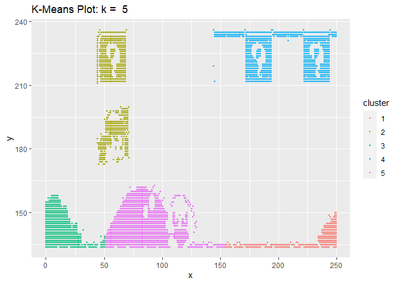

Exercise 16: Clustering
================
Taniya Adhikari"
11/1/2020

Importing the dataset

``` r
library(tinytex)
library(knitr)
df1 <- read.csv("data/clustering-data.csv")
summary(df1)
```

    ##        x               y        
    ##  Min.   :  0.0   Min.   :134.0  
    ##  1st Qu.: 56.0   1st Qu.:141.0  
    ##  Median : 82.0   Median :154.0  
    ##  Mean   :109.6   Mean   :175.7  
    ##  3rd Qu.:180.0   3rd Qu.:218.0  
    ##  Max.   :249.0   Max.   :236.0

``` r
# second dataset to check the fit for data
df2 <- df1
df3 <- df1
library(VIM)
aggr(df1)
```

<!-- -->

Looks like the data has no missing value.

Plot the dataset using a scatter plot.

``` r
library(ggplot2)
ggplot(data = df1, aes(x = x, y = y)) + 
  geom_point(size=0.8) + 
  ggtitle("Scatter Plot Clustering Data")
```

<!-- -->

After looking at the scatterplot it looks like the clustering data
represent Mario game plot.

Fit the dataset using the k-means algorithm from k=2 to k=12. Create a
scatter plot of the resultant clusters for each value of k.

``` r
library(class)

k <- 2:12
for(i in k){
    # k-means model
    clusters1 =  kmeans(df1, i)
    
    # save the cluster in the dataset
    df1$cluster <- as.factor(clusters1$cluster)

    title <- paste("K-Means Plot: k = ", i)
    # scatter plot
    plot <- ggplot(data = df1, aes(x = x, y = y, colour=cluster)) + 
    geom_point(size=.8) + 
      ggtitle(title)
    
    print(plot)

}
```

<!-- --><!-- --><!-- --><!-- --><!-- --><!-- --><!-- --><!-- --><!-- --><!-- --><!-- -->

Calculate this average distance from the center of each cluster for each
value of k and plot it as a line chart where k is the x-axis and the
average distance is the y-axis.

``` r
library(class)
library(FNN)

k <- 1:25
average.v <- NULL
k.v <- NULL

for(i in k){
    # k-means model
    clusters2 =  kmeans(df2, i)
    
    # save the cluster in the dataset
    df2$cluster <- as.factor(clusters2$cluster)
    
    df2$x_center <- clusters2$centers[df2$cluster, "x"]
    
    df2$y_center <- clusters2$centers[df2$cluster, "y"]
   head(df2)
   
   df2$total_dist <- sqrt((df2$x-df2$x_center)**2 + (df2$y-df2$y_center)**2)
   
   avg <- mean(df2$total_dist)
   k.v[i] <- i
   average.v[i] <- avg

}
avg_df <- data.frame(k.v, average.v)
point <- avg_df[avg_df["average.v"] < 20]
elbow.point <-point[[1]][1]
#plotting the average distance
ggplot(data=avg_df, aes(x = k.v, y = average.v)) + 
  geom_point() + geom_line(aes(colour="blue")) + geom_vline(xintercept = elbow.point, linetype =2) + xlab(" K Values") + ylab("Average Distance") + 
  ggtitle("Average distance Metric")
```

<!-- -->

One way of determining the “right” number of clusters is to look at the
graph of k versus average distance and finding the “elbow point”.
Looking at the graph you generated in the previous example, what is the
elbow point for this dataset?

Since each time I ran the code, I was getting different results for the
elbow point so it was little harder to predict the value. I did run it
enough to notice that elbow point was falling somewhere below average
distance of 20. So I selected the first point after the average distance
= 20. In this graph my estimated elbow point is 6.

There are several different method to check the fit of the model. One of
them is Elbow method which uses within-cluster sum of square (WSS).
Below I graphed the WSS and estimated elbow point which is similar to
the average distance elbow point.

``` r
library(factoextra)
library(NbClust)


# Elbow method
fviz_nbclust(df3, kmeans, method = "wss", k.max=25) +
  geom_vline(xintercept = elbow.point, linetype = 2) + # add line for better visualisation
  labs(subtitle = "Elbow method") # add subtitle
```

<!-- -->

**Referrences**

1.  <https://www.statsandr.com/blog/clustering-analysis-k-means-and-hierarchical-clustering-by-hand-and-in-r/>
2.  <http://www.nbertagnolli.com/jekyll/update/2015/12/10/Elbow.html>
3.  <https://www.edureka.co/blog/k-means-clustering/>
4.  <https://www.datacamp.com/community/tutorials/k-means-clustering-r>
